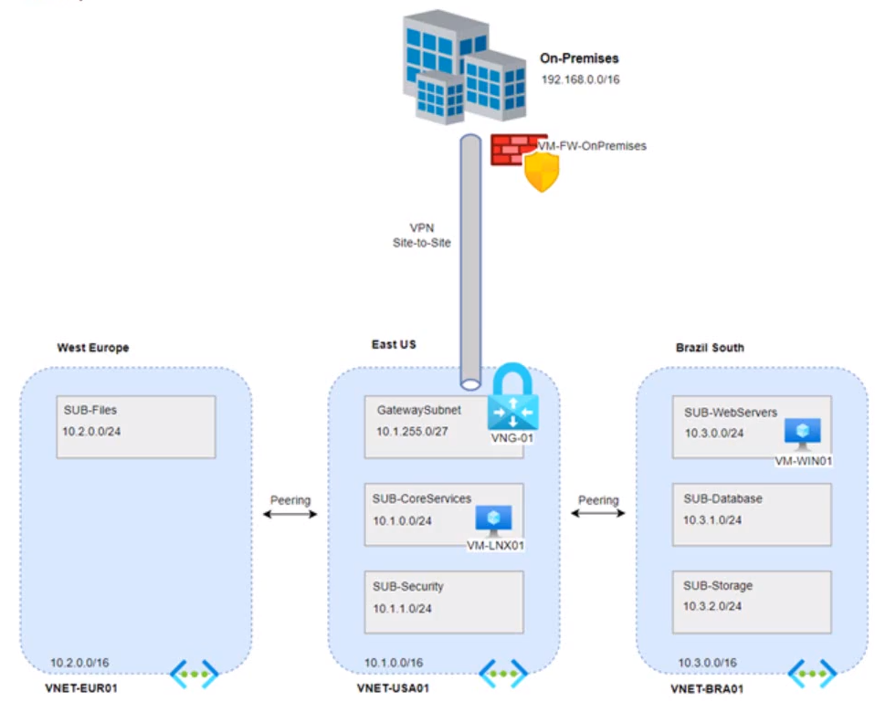

# Dia 1 - 2024-02-18

## Tópicos Estudados

- Tópico 1: Azure Network.
  - Criar estrutura de rede usando 3 VNETs em regiões diferentes, com suas respectivas Subnets;
  - Criação/Configuração VPN Azure;
  - Deploy Virtual Network Gateway;
  - Criar estrutura de rede para simular ambiente On-Premises;
  - Deploy VM para similar firewall on-premises;
  - Deploy Local Network Gateway;
  - Deploy VPN Point to Site

## Resumo

1. Domingão também é dia, e com o objetivo de aprofundar os conhecimentos em Azure sigo estudando e praticando para releembrar e realizar o exame az-104. Hoje, foi dia de colocar em pratica a criação de toda a estrutura de rede inter-regiões, criar peering, configurar gateway e gateway de vpn para criação de vpn p2s.



## Exemplos Práticos


```shell
// Exemplo de código aqui
```
